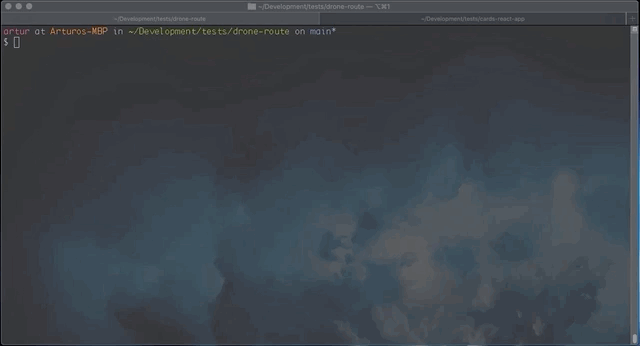

<!-- PROJECT -->
<h2 align="center">Drones Route Node App</h2>

<!-- GETTING STARTED -->
## Getting Started

To clone and run this application.

### Prerequisites

you'll need [Git](https://git-scm.com) and [Node.js](https://nodejs.org/en/download/) (which comes with [npm](http://npmjs.com)) installed on your computer. From your command line:

### Installation

1. Clone this repo
```sh
git clone https://github.com/arturoliduena/drone-route.git
```

2. Go into the repository
```sh
cd drone-route
```

3. install package
```sh
npm install
```

4. Starting the development server
```sh
npm start
```
#### Example


### Testing
This project has tests.

run the test
```sh
npm test
```
#### Example

